# How to generate vector tiles

## The whole structure of vectortiles production in the toolkits


## 1. Create mbtiles from PostGIS
- [postgis2mbtiles](https://github.com/watergis/postgis2mbtiles) : This module will create `mbtiles` by GeoJSON data which is retrieved from `PostGIS`. this module is using [tippecanoe](https://github.com/mapbox/tippecanoe), so please use Docker to generate mbtiles if your machine is `Windows`. But you can use the module directory in `MacOS` or `Ubuntu` machine

First of all, you need to make SQL queries for each layer on `config.js`, so `postgis2mbtiles` tool will extract required data from PostGIS and a mbtiles will be created.

Making your own SQLs for your database, this step is quite significant. However, it might have some difficulties to create SQLs. For your reference, you can have a look of following two water supply providers' setting.

- `Narok Water and Sewerage Services Co., Ltd, KENYA` : [config.js](https://raw.githubusercontent.com/narwassco/vt-map/master/config.js)
- `Water and Sanitation Corporation, Ltd, RWANDA` : [config.js](https://raw.githubusercontent.com/WASAC/vt/master/config.js)

Because this approach can use SQL language to directly extract the data from PostGIS, it can be very frexiblely to adopt any water services providers' GIS database.

### Examples of Vectortiles Design

The design of vectortiles depends on your GIS database and your needs. The below designs are just an example of vectortiles implementation for your reference.

- [Vectortiles Design for Narok water, Kenya](./Vector-Tile-Design-for-Narok.md)
- [Vectortiles Design for WASAC, Rwanda](./Vector-Tile-Design-for-WASAC.md)


## 2. Design your Mapbox Style on Mapbox Studio
Next step is to design your own Mapbox Style on Mapbox Studio by using `mbtile` which was produced before.

For better designs of beautiful water maps, you might need to design your own icons for your layers. You may use the following icons for your reference.

- `Narok Water and Sewerage Services Co., Ltd, KENYA` : [water-icons](https://github.com/narwassco/water-icons)
- `Water and Sanitation Corporation, Ltd, RWANDA` : [water-icons](https://github.com/WASAC/water-icons)

You may need to create an account of Mapbox Studio. Also, please keep your public accessToken as well. 

You can see official manual of Mapbox Studio [here](https://docs.mapbox.com/studio-manual/overview/).

You may need to repeat process of `genrating mbtiles` and `styling in Mapbox Studio` for finalying your stylefiles.

## 3. Deploy Vector Tile to gh-pages

Once your stylefiles' design and mbtiles are completed, now you are ready to deploy your vector tiles to gh-pages. [postgis2vectortiles](https://github.com/watergis/postgis2vectortiles) will assist you to create and deploy vector tiles.

There are two cases for deploying.


### i. [`narwassco/vt-map` approach] A case of Narok Water, Kenya
If your coverage area is small, you can use the approach of `Narok Water` to deploy. Please have a look following repository.

- [vt-map](https://github.com/narwassco/vt-map)
  This module will use the following submodules to create Mapbox Vector Tile for deployment to gh-pages.
  - [postgis2mbtiles](https://github.com/narwassco/postgis2mbtiles): It creates `mbtiles` from PostGIS.
  - [mbtiles2pbf](https://github.com/narwassco/mbtiles2pbf): It converts from `mbtiles` to `pbf(mvt)` tiles.

This module uses [tippecanoe](https://github.com/mapbox/tippecanoe) for producing mbtiles and uses [mbutil](https://github.com/mapbox/mbutil) to convert `mbtiles`. However, Narok water's GIS computer is Windows 10 Pro, so it is not easy to run `tippecanoe`, I developed `Docker` to create Mapbox Vector Tile.

### ii. [`WASAC/vt` approach] A case of WASAC, Rwanda
If your coverage area is huge, I am afraid it is not easy to deploy thousands of vector tiles to Github pages. So you can use `WASAC` approach to deploy `mbtiles` first, then use `Github Actions` to extract vector tiles from your `mbtiles`. You can see the following repository for your reference.

- [vt](https://github.com/WASAC/vt)
  This module will use the following submodules to create Mapbox Vector Tile for deployment to gh-pages.
  - [postgis2mbtiles](https://github.com/narwassco/postgis2mbtiles): It creates `mbtiles` from PostGIS. `postgis2mbtiles` module will run on your local computer.
  - [mbtiles2pbf](https://github.com/narwassco/mbtiles2pbf): It converts from `mbtiles` to `pbf(mvt)` tiles. `mbtiles2pbf` will run on `Github Actions`.

### Automate the process of delopyment

You can use `Task Scheduler` of Windows or `crontab` of Linux to automate your deployment process to be implemented frequently. So you can just concentrate to maintain GIS database.

## 4. Deploy Mapbox Stylefiles and Sprite files on gh-pages
- [sprite-creater](https://github.com/watergis/sprite-creator) : This module will assist you to create sprite files from your icons. 

- Please create a repository which can be named `mapbox-stylefiles`. You can organize stylefiles and sprite files as following structures.
<details>
<summary>Folder Structures</summary>

```
|- docs
 |- satellite
  |- sprite
   |- sprite.json
   |- sprite.png
   |- sprite@2x.json
   |- sprite@2x.png
   |- sprite@4x.json
   |- sprite@4x.png
  |- style.json
 |- street
  |- sprite
   |- sprite.json
   |- sprite.png
   |- sprite@2x.json
   |- sprite@2x.png
   |- sprite@4x.json
   |- sprite@4x.png
  |- style.json
|- src
 |- config.js
 |- sprite-create.js
```
</details>

There are the following use cases. You may fork one of the repositories and adopted to your own needs.
- `Narok Water and Sewerage Services Co., Ltd, KENYA` : [mapbox-stylefiles](https://github.com/narwassco/mapbox-stylefiles)
- `Water and Sanitation Corporation, Ltd, RWANDA` : [mapbox-stylefiles](https://github.com/WASAC/mapbox-stylefiles)

### To create sprite files from your icons

The Spritefiles will be generated from [mapbox/maki](https://github.com/mapbox/maki) icons and [water-icons](https://github.com/narwassco/water-icons) icons under `docs` of this repository. In `Narok Water`'s case, the following repositories manage our icons which are being used in our style files.
  - [water-icons](https://github.com/narwassco/water-icons) : It includes our own customized icon for water assets.
  - [mapbox-street-icons](https://github.com/narwassco/mapbox-street-icons) : It includes icons of Mapbox Street style and customized `water-icons`.
  - [mapbox-satellite-icons](https://github.com/narwassco/mapbox-satellite-icons):It includes icons of Mapbox Satellite style and customized `water-icons`.

### To put your Mapbox Stylefiles

You can download your Mapbox Stylefiles from Mapbox Studio, then you can delete unnecessary contents from the stylefile, and changed url of `vector tile` and `sprite file` on it. 


## 5. Develop and Deploy Web Application

You can use [Mapbox GL JS](https://docs.mapbox.com/mapbox-gl-js/api/) to develop your own web application and delopy it to gh-pages. It is also possible for you to fork our water services providers' application.

- `Narok Water and Sewerage Services Co., Ltd, KENYA` : [mapbox-gl-js-client](https://github.com/narwassco/mapbox-gl-js-client) 
- `Water and Sanitation Corporation, Ltd, RWANDA` : [mapbox-gl-js-client](https://github.com/WASAX/mapbox-gl-js-client) 

### Automating deployment process for web application
Both Narok water and WASAC's applications are using Circle CI to deploy the application to gh-pages automatically. You can also use Circle CI or Github Actions to automate.

---
`Copyright © 2020 Jin IGARASHI`